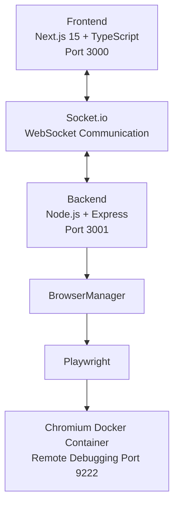

# Remote Browser Control


A full-stack remote browser control system — stream and interact with a headless Chromium browser running in Docker, directly from your web browser.

> Built as an SDE internship assignment for BLD. Completed across 11 development phases in under 24 hours.

---

## Features

- **Live Browser Streaming** — Chromium screen streamed via Socket.io at 2fps (JPEG)
- **Mouse Control** — Click any element with coordinate-mapped precision
- **Keyboard Input** — Type text, use special keys (Enter, Backspace, Tab, Arrows)
- **Scroll Support** — Mouse wheel scrolls the remote page
- **URL Navigation** — Navigate to any URL
- **Browser History** — Back, Forward, Refresh
- **Page Info** — Live URL and page title tracking
- **Docker Integration** — Chromium runs in an isolated container
- **Professional UI** — Dark SaaS-style dashboard inspired by Browserbase / Railway

---

## Architecture



### Streaming Data Flow

```text
Playwright
→ page.screenshot({ type: 'jpeg', quality: 60 })
→ Buffer → Base64 string
→ Socket.io emit('browser-frame')
→ React setState(frameSrc)
→ 
```

### Click Data Flow

```text
User clicks on 
→ getBoundingClientRect() on img element
→ scaleX = 1280 / renderedWidth
→ scaleY = 720  / renderedHeight
→ Socket.io emit('mouse-click', { x, y })
→ page.mouse.click(x, y)
```

---

## Tech Stack

| Layer | Technology |
|---|---|
| Frontend | Next.js 15, TypeScript, Tailwind CSS v4, Zustand |
| Real-time | Socket.io (WebSocket) |
| Backend | Node.js, Express, TypeScript, ts-node |
| Browser Automation | Playwright |
| Container | Docker, Chromium (Debian bookworm) |

---

## Folder Structure

```text
remote-browser-control/
├── frontend/
│   ├── app/
│   │   ├── page.tsx
│   │   ├── layout.tsx
│   │   └── globals.css
│   └── src/
│       ├── components/
│       │   ├── BrowserControls.tsx
│       │   ├── BrowserViewer.tsx
│       │   ├── DashboardLayout.tsx
│       │   ├── Navbar.tsx
│       │   └── SessionInfo.tsx
│       ├── hooks/
│       │   └── useSocket.ts
│       ├── lib/
│       │   └── socket.ts
│       ├── store/
│       │   └── browserStore.ts
│       └── types/
│           └── browser.ts
├── backend/
│   ├── src/
│   │   ├── server.ts
│   │   ├── config/
│   │   │   └── constants.ts
│   │   ├── services/
│   │   │   └── BrowserManager.ts
│   │   ├── socket/
│   │   │   └── socketHandler.ts
│   │   ├── types/
│   │   │   └── browser.types.ts
│   │   └── utils/
│   │       └── logger.ts
│   └── .env
├── docker/
│   ├── Dockerfile
│   └── docker-compose.yml
├── scripts/
│   ├── start-docker.sh
│   └── stop-docker.sh
└── README.md
```

---

## Installation

### Prerequisites

- Node.js 18+
- Docker Desktop (or Docker Engine)
- Git

### Clone

```bash
git clone https://github.com/nihal-710/remote-browser-control.git
cd remote-browser-control
```

### Install dependencies

```bash
cd frontend && npm install
cd ../backend && npm install
```

---

## Running Locally

### Option A — Local Chromium (no Docker)

Set `USE_DOCKER=false` in `backend/.env`, then:

```bash
# Terminal 1
cd backend && npm run dev

# Terminal 2
cd frontend && npm run dev
```

Open **http://localhost:3000**

---

### Option B — Docker (Chromium in container)

```bash
# Step 1: Start Chromium container
./scripts/start-docker.sh

# Step 2: Enable Docker mode
# In backend/.env set:
#   USE_DOCKER=true
#   CDP_URL=http://localhost:9222

# Step 3: Start backend
cd backend && npm run dev

# Step 4: Start frontend
cd frontend && npm run dev
```

Open **http://localhost:3000**

---

## Docker Commands

```bash
# Build and start
cd docker && docker compose up -d --build

# Verify Chromium is running
curl http://localhost:9222/json/version

# View logs
docker logs remote-browser-chromium -f

# Stop
cd docker && docker compose down
```

---

## Environment Variables

**`backend/.env`**

| Variable | Default | Description |
|---|---|---|
| `PORT` | `3001` | Backend port |
| `FRONTEND_URL` | `http://localhost:3000` | CORS origin |
| `SCREENSHOT_INTERVAL` | `500` | ms between frames |
| `BROWSER_WIDTH` | `1280` | Viewport width |
| `BROWSER_HEIGHT` | `720` | Viewport height |
| `USE_DOCKER` | `false` | Connect via CDP |
| `CDP_URL` | `http://localhost:9222` | Chromium CDP endpoint |
| `CHROMIUM_PATH` | `/usr/bin/chromium-browser` | Local binary path |

---

## Usage Guide

1. Open **http://localhost:3000**
2. Click **Start** — Chromium launches
3. Google loads in the viewer panel
4. **Click** anywhere on the stream to interact
5. **Type** after clicking an input — "KB Active" badge confirms keyboard focus
6. **Scroll** with mouse wheel inside the viewer
7. Use the **URL bar** or **Back / Forward / Refresh** to navigate
8. Click **Stop** to end the session

---

## Known Issues

### Stream lag after rapid navigation

After multiple rapid back/forward/refresh actions, the streamed image may lag 1–2 frames behind the actual page state. Navigation state (URL, title) updates correctly.

**Root cause:** Fixed-interval `setInterval` screenshot polling runs independently of navigation events. A screenshot captured mid-navigation shows a transitional state.

**Workaround:** Stream catches up automatically within 500ms.

**Future fix:** Listen to `page.on('load')` and emit a screenshot immediately on page load, eliminating interval lag entirely.

---

## Future Improvements

- Event-driven screenshots on `page.on('load')` for zero lag
- WebRTC / canvas streaming for 30fps video
- Multi-tab support
- Session recording and replay
- Mobile gesture support (pinch, swipe)
- Authentication and multi-user sessions

---

## Troubleshooting

| Problem | Fix |
|---|---|
| Socket shows "Disconnected" | Ensure backend is running: `cd backend && npm run dev` |
| Browser won't start (Docker mode) | Run `curl http://localhost:9222/json/version` — if it fails, container isn't ready |
| Clicks not registering | Click directly on the image area, not the sidebar |
| Keyboard not working | Click inside the viewer first — "KB Active" badge must appear |
| Scroll not working | Hover mouse over viewer and use mouse wheel |
| Stream appears frozen | Hard refresh: `Ctrl+Shift+R` |

---

## License

MIT